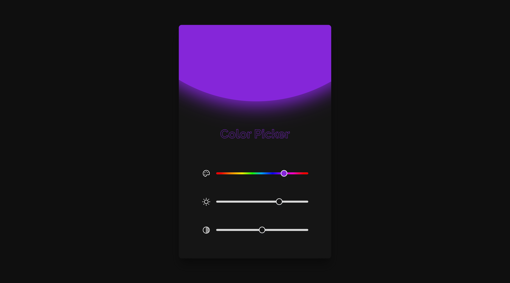

<h1 align="center"> Color Picker - BoraCodar#24 </h1>

[Clique aqui para acessar](https://color-picker-maik-emanoel.vercel.app/)

## 🚀 Tecnologias

Esse projeto foi desenvolvido com as seguintes tecnologias:

- React.js
- Tailwind CSS
- Git and GitHub

## 💻 Projeto

Este projeto é um Color Picker no qual podemos testar uma imensa variedade de cores com diferentes tons, saturações e brilho. 

Projeto construído a partir do layout proposto no desafio [#BoraCodar24](https://boracodar.dev/) realizado pela [Rocketseat](https://rocketseat.com.br).
Após o desenvolvimento do projeto inicial, adicionei novas features, tais quais:

- Layout responsivo (Adaptado para telas menores);
- Botões funcionais;
- Efeitos hover/animatação;
- Entre outras pequenas modificações.

## 🔖 Layout

Você pode visualizar o layout do projeto proposto através [DESSE LINK](https://www.figma.com/community/file/1250810959627241982). É necessário ter conta no [Figma](https://figma.com) para acessá-lo.